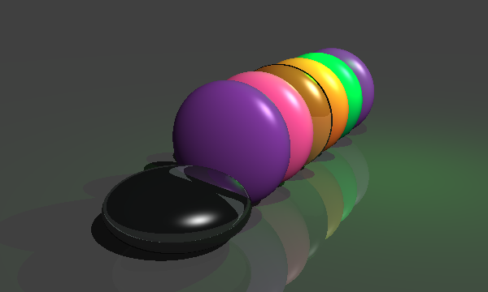
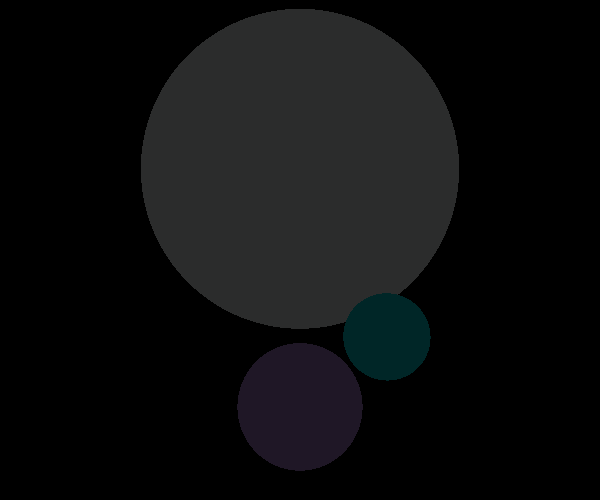
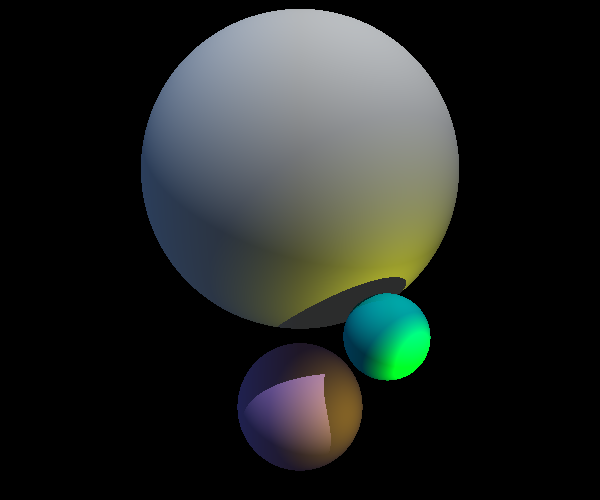
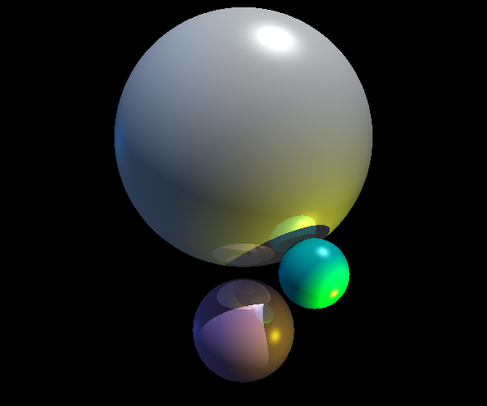
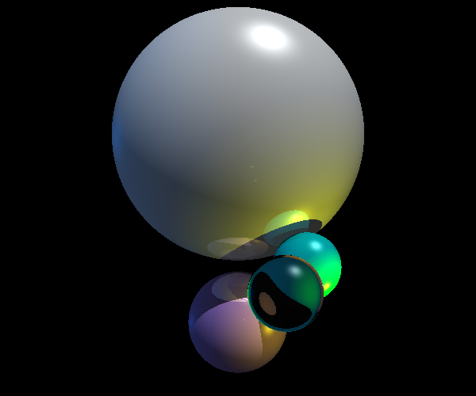

# py-cgi
Python program for generating and displaying 3D CGI using a ray tracer algorithm.

Author: Tomas Tamantini 2020

Program includes 5 different optical effects:
* Ambient light
* Diffuse reflection
* Specular reflection (Phong-Blinn)
* Mirror-like reflection
* Refraction

The 5 stages below show the addition of each of those effects.

